<!-- ================================================================= -->
<!-- PRAVEEN VERMA | FULL STACK SOFTWARE ENGINEER                     -->
<!-- Theme: Deep Obsidian & Electric Indigo/Cyan (AI / SaaS Aesthetic)-->
<!-- Portfolio Landing Page for GitHub                                 -->
<!-- ================================================================= -->

<div align="center">

  <!-- Hero Banner SVG (Engineered Vector Asset) -->
  <a href="https://github.com/praveenstp09">
    
  </a>

  <!-- Animated Typing Dynamic Terminal Subtitle -->
  <p align="center">
    <a href="https://github.com/praveenstp09">
      
    </a>
  </p>

  <!-- Primary Interactive Action Badges -->
  <p align="center">
    <a href="mailto:praveenverma0933@gmail.com">
      
    </a>
    &nbsp;
    <a href="https://www.linkedin.com/in/praveen-verma-b90333282/" target="_blank">
      
    </a>
    &nbsp;
    <a href="https://leetcode.com/u/praveenstp09/" target="_blank">
      
    </a>
    &nbsp;
    <a href="https://github.com/praveenstp09">
      
    </a>
  </p>

  <!-- Live Telemetry & Profile Insights -->
  <p align="center">
    
    &nbsp;&nbsp;
    
    &nbsp;&nbsp;
    
  </p>

</div>

<p align="center">
  
</p>

<!-- ================================================================= -->
<!-- QUICK PROFILE / DEVELOPER DASHBOARD                               -->
<!-- ================================================================= -->

### ⚡ Developer Telemetry & Profile Overview

<table width="100%">
  <tr>
    <td width="50%" valign="top">
      <b>📍 Location</b><br>
      <code>Noida, Uttar Pradesh, India</code>
    </td>
    <td width="50%" valign="top">
      <b>🎓 Academics</b><br>
      <code>B.Tech CSE @ AKGEC (2022–2026) · CGPA: 8.15</code>
    </td>
  </tr>
  <tr>
    <td width="50%" valign="top">
      <b>💼 Current Status</b><br>
      <code>Open for SDE & Full Stack Roles (Graduating May 2026)</code>
    </td>
    <td width="50%" valign="top">
      <b>🧠 Algorithmic Problem Solving</b><br>
      <code>400+ DSA Solved · LeetCode & CodeChef</code>
    </td>
  </tr>
  <tr>
    <td width="50%" valign="top">
      <b>🏢 Industry Experience</b><br>
      <code>Full Stack Intern @ Dvertex Info System (Safai Mitra)</code>
    </td>
    <td width="50%" valign="top">
      <b>⚙️ Core Specialization</b><br>
      <code>MERN Stack · Distributed REST APIs · Cryptographic Webhooks</code>
    </td>
  </tr>
</table>

<p align="center">
  
</p>

<!-- ================================================================= -->
<!-- ABOUT ME SECTION                                                  -->
<!-- ================================================================= -->

### 👨‍💻 Engineering Profile & About Me

> *"I architect resilient, high-throughput full-stack software systems that translate complex technical logic into seamless, high-performance end-user products."*

I am a **Full Stack Software Engineer** specializing in the **MERN ecosystem** (React.js, Node.js, Express.js, MongoDB) and scalable web infrastructure. With hands-on internship experience engineering features for the live **Safai Mitra** production platform at **Dvertex Info System**, I build maintainable, component-driven frontends paired with resilient, test-driven backend architectures.

#### What Sets My Engineering Apart:
* **Production-Tested Systems**: Engineered live data-filter engines, asynchronous state machines, and reusable UI component libraries for enterprise web applications.
* **Security & FinTech Integrations**: Implemented Razorpay payment gateways with cryptographic webhook signature validation (`HMAC SHA256`), dynamic coupon engines, and granular Role-Based Access Control (RBAC).
* **Database & Query Performance**: Experienced with MongoDB compound indexing and aggregation pipelines, reducing query latency across high-cardinality e-commerce catalogs.
* **Algorithmic Rigor**: Solved **400+ Data Structures & Algorithms challenges** across LeetCode and CodeChef, fostering an intuition for space/time complexity and memory optimization.

```text
┌── SYSTEM CAPABILITIES ─────────────────────────────────────────────────────────────┐
│ ✦ Frontend Architecture : Component modularity, state containers, debounced I/O    │
│ ✦ Backend Systems       : RESTful micro-architectures, JWT security, auth chains   │
│ ✦ Data Engineering      : Schema normalization, compound indexes, aggregation runs │
│ ✦ Cloud & Tooling       : Cloudinary CDN pipelines, Agile sprints, Postman suites  │
└────────────────────────────────────────────────────────────────────────────────────┘
```

<p align="center">
  
</p>

<!-- ================================================================= -->
<!-- TECHNICAL ARSENAL / TECH STACK                                    -->
<!-- ================================================================= -->

### 🛠️ Technical Arsenal

<table width="100%">
  <thead>
    <tr>
      <th width="24%" align="left">Domain</th>
      <th width="36%" align="left">Technologies &amp; Frameworks</th>
      <th width="40%" align="left">Core Competencies</th>
    </tr>
  </thead>
  <tbody>
    <tr>
      <td><b>Programming Languages</b></td>
      <td>
        <a href="https://skillicons.dev">
          
        </a>
      </td>
      <td>JavaScript (ES6+), TypeScript, Java, C++, C#, C</td>
    </tr>
    <tr>
      <td><b>Frontend Engineering</b></td>
      <td>
        <a href="https://skillicons.dev">
          
        </a>
      </td>
      <td>React.js, Next.js, Tailwind CSS, Responsive UI, Context API, Storybook</td>
    </tr>
    <tr>
      <td><b>Backend &amp; APIs</b></td>
      <td>
        <a href="https://skillicons.dev">
          
        </a>
      </td>
      <td>Node.js, Express.js, RESTful APIs, ASP.NET Core, GraphQL, JWT Auth</td>
    </tr>
    <tr>
      <td><b>Databases &amp; Storage</b></td>
      <td>
        <a href="https://skillicons.dev">
          
        </a>
      </td>
      <td>MongoDB, PostgreSQL, MySQL, Schema Design, Aggregation Pipelines</td>
    </tr>
    <tr>
      <td><b>Tools &amp; DevOps</b></td>
      <td>
        <a href="https://skillicons.dev">
          
        </a>
      </td>
      <td>Git, GitHub, Postman, Vercel, Render, Cloudinary CDN, Storybook</td>
    </tr>
  </tbody>
</table>

<p align="center">
  
</p>

<!-- ================================================================= -->
<!-- FEATURED PROJECTS (INTERACTIVE SAAS PRODUCT CARDS)               -->
<!-- ================================================================= -->

### 🚀 Flagship Engineering Projects

<!-- PROJECT 1: PharmaCode07 -->
<details open>
<summary><b>🧪 PharmaCode07 — Full Stack EdTech &amp; CBT Exam Platform</b> </summary>
<br>

<table>
  <tr>
    <td colspan="2">
      <b>An enterprise-grade EdTech and Computer-Based Testing (CBT) platform</b> delivering interactive test series, structured study notes, and curated model papers with automated assessment pipelines.
    </td>
  </tr>
  <tr>
    <td width="20%"><b>Core Stack</b></td>
    <td><code>React.js</code> · <code>Node.js</code> · <code>Express.js</code> · <code>MongoDB</code> · <code>Razorpay API</code> · <code>Cloudinary CDN</code></td>
  </tr>
  <tr>
    <td><b>Architecture</b></td>
    <td>MERN Microservices Architecture · Cryptographic Webhook Processor · Role-Based Access Control (RBAC)</td>
  </tr>
  <tr>
    <td><b>Key Engineering</b></td>
    <td>
      • <b>Real-Time CBT Testing Engine</b>: Built with client-side state machine timers, question palette navigation, and instant auto-grading telemetry.<br>
      • <b>FinTech Integration</b>: Secure Razorpay payment gateway with <code>HMAC-SHA256</code> cryptographic webhook verification, dynamic coupon engine, and zero-latency access provisioning.<br>
      • <b>Admin Content Studio</b>: Bulk MCQ parser, structured media uploads via Cloudinary CDN, and multi-tier role authorization.
    </td>
  </tr>
  <tr>
    <td><b>Links &amp; Source</b></td>
    <td>
      <a href="https://github.com/praveenstp09/Pharmacode07">
        
      </a>
      &nbsp;
      <a href="https://github.com/praveenstp09/Pharmacode07">
        
      </a>
    </td>
  </tr>
</table>

</details>

<br>

<!-- PROJECT 2: TechKart -->
<details open>
<summary><b>🛒 TechKart — Full Stack High-Performance E-Commerce Engine</b> </summary>
<br>

<table>
  <tr>
    <td colspan="2">
      <b>Modern full-stack electronic commerce platform</b> engineered for ultra-fast product discovery, filtered navigation, and friction-free multi-item checkout workflows.
    </td>
  </tr>
  <tr>
    <td width="20%"><b>Core Stack</b></td>
    <td><code>React.js</code> · <code>Node.js</code> · <code>Express.js</code> · <code>MongoDB</code> · <code>React Context API</code> · <code>JWT</code> · <code>BCrypt</code></td>
  </tr>
  <tr>
    <td><b>Architecture</b></td>
    <td>RESTful Service Layer · Compound Indexed Database Engine · Persistent Cart State Machine</td>
  </tr>
  <tr>
    <td><b>Key Engineering</b></td>
    <td>
      • <b>High-Throughput Catalog Querying</b>: Implemented debounced product searches and multi-facet filtering backed by MongoDB compound indexing and aggregation pipelines.<br>
      • <b>State &amp; Security Layer</b>: Centralized cart state persistence across page sessions via React Context API, protected routes with JWT access tokens, and salted BCrypt password hashing.<br>
      • <b>API Optimization</b>: Strict payload validation, sanitization middlewares, and low-latency payload serialization.
    </td>
  </tr>
  <tr>
    <td><b>Links &amp; Source</b></td>
    <td>
      <a href="https://github.com/praveenstp09/Ecommerce">
        
      </a>
      &nbsp;
      <a href="https://github.com/praveenstp09/Ecommerce">
        
      </a>
    </td>
  </tr>
</table>

</details>

<br>

<!-- PROJECT 3: Safai Mitra Production Contribution -->
<details>
<summary><b>🛡️ Enterprise Platform Contribution — Safai Mitra Production System</b> </summary>
<br>

<table>
  <tr>
    <td colspan="2">
      <b>Live Municipal Operations &amp; Resource Management System</b> utilized for tracking urban utility operations, citizen service escalations, and internal workforce assignments.
    </td>
  </tr>
  <tr>
    <td width="20%"><b>Core Stack</b></td>
    <td><code>React.js</code> · <code>Node.js</code> · <code>Express.js</code> · <code>CSS3</code> · <code>Postman</code> · <code>Agile Sprints</code></td>
  </tr>
  <tr>
    <td><b>Role &amp; Contribution</b></td>
    <td>Full Stack Engineering Intern @ Dvertex Info System Pvt. Ltd.</td>
  </tr>
  <tr>
    <td><b>Key Engineering</b></td>
    <td>
      • Engineered <b>8+ reusable modular UI components</b> for the company's internal design system.<br>
      • Redesigned and shipped critical operational screens by adding multi-criteria criteria filters, real-time status forms, and asynchronous state synchronization.<br>
      • Formulated and executed Postman automated testing collections across RESTful backend endpoints to ensure zero breaking regressions.
    </td>
  </tr>
</table>

</details>

<p align="center">
  
</p>

<!-- ================================================================= -->
<!-- PROFESSIONAL EXPERIENCE & INTERNSHIP                              -->
<!-- ================================================================= -->

### 💼 Professional Experience

```text
┌────────────────────────────────────────────────────────────────────────────────────┐
│ Dvertex Info System Pvt. Ltd.                                    Noida, UP, India │
│ Full Stack Developer Intern                                 July 2025 – Sept 2025  │
└────────────────────────────────────────────────────────────────────────────────────┘
```

* **Enterprise Component Engineering**: Developed **8+ reusable, responsive UI components** in React.js and CSS for the organization's standardized UI library, accelerating sprint velocity.
* **Production Feature Delivery**: Collaborated on the live **Safai Mitra** platform, implementing multi-criteria filtering engines, dynamic multi-step form fields, and asynchronous background data refreshes.
* **Backend API Integration & Testing**: Integrated high-reliability RESTful API endpoints with Node.js and Express.js, conducting comprehensive endpoint validation and error handling via Postman.
* **Agile Sprint Execution**: Actively resolved **10+ mission-critical UI and state bugs** in cross-functional Agile sprints, optimizing DOM reconciliation and mobile responsiveness.

<p align="center">
  
</p>

<!-- ================================================================= -->
<!-- EDUCATION & ACADEMIC CREDENTIALS                                 -->
<!-- ================================================================= -->

### 🎓 Education & Academic Background

<table width="100%">
  <tr>
    <td>
      <b>Ajay Kumar Garg Engineering College (AKGEC), Ghaziabad</b><br>
      <i>Bachelor of Technology (B.Tech) in Computer Science &amp; Engineering</i><br>
      <span>Duration: <b>2022 – 2026</b> &nbsp;|&nbsp; Cumulative GPA: <b>8.15 / 10.0</b></span>
    </td>
    <td align="right" width="30%">
      
    </td>
  </tr>
</table>

<p align="center">
  
</p>

<!-- ================================================================= -->
<!-- ACHIEVEMENTS & CERTIFICATIONS                                     -->
<!-- ================================================================= -->

### 🏆 Recognitions & Key Milestones

<table width="100%">
  <thead>
    <tr>
      <th width="30%" align="left">Category</th>
      <th width="70%" align="left">Details &amp; Verified Impact</th>
    </tr>
  </thead>
  <tbody>
    <tr>
      <td><b>🧠 Algorithmic Problem Solving</b></td>
      <td>
        Successfully solved <b>400+ DSA problems</b> across <b>LeetCode</b> and <b>CodeChef</b>, specializing in graph traversals, dynamic programming, and binary search optimization.
      </td>
    </tr>
    <tr>
      <td><b>🚀 Production Deployment</b></td>
      <td>
        Shipped production features directly to users on the <b>Safai Mitra enterprise platform</b> during internship at Dvertex Info System.
      </td>
    </tr>
    <tr>
      <td><b>📜 Full Stack Credentials</b></td>
      <td>
        Completed rigorous hands-on coursework in MERN Architecture, RESTful API design, and Database Management Systems.
      </td>
    </tr>
    <tr>
      <td><b>🐙 GitHub Milestones</b></td>
      <td>
        Earned <b>Pull Shark</b> and <b>YOLO</b> GitHub achievement badges through collaborative Git version control workflows.
      </td>
    </tr>
  </tbody>
</table>

<p align="center">
  
</p>

<!-- ================================================================= -->
<!-- GITHUB DEVELOPER ANALYTICS DASHBOARD                              -->
<!-- ================================================================= -->

### 📊 Developer Analytics & GitHub Telemetry

<div align="center">

  <!-- Stats Card + Streak Card -->
  <p align="center">
    <a href="https://github.com/praveenstp09">
      
      
    </a>
  </p>

  <!-- Top Languages Compact Card -->
  <p align="center">
    <a href="https://github.com/praveenstp09">
      
    </a>
  </p>

  <!-- Activity Graph -->
  <p align="center">
    <a href="https://github.com/praveenstp09">
      
    </a>
  </p>

</div>

<p align="center">
  
</p>

<!-- ================================================================= -->
<!-- CURRENTLY BUILDING / LEARNING / EXPLORING                         -->
<!-- ================================================================= -->

### 🛰️ Engineering Roadmap & Current Focus

```yaml
Current_Initiatives:
  Building:
    - PharmaCode07 v2.0 with real-time WebSocket test proctoring
    - High-concurrency payment webhook reconciliation workers
    - Modular UI library patterns using Storybook and Tailwind CSS

  Deep_Diving:
    - Distributed System Design & Microservice Scalability
    - Asynchronous Event Pipelines (Redis Queues & Pub/Sub)
    - Advanced Database Sharding & Read-Replica architectures

  Exploring:
    - Next.js 14 App Router with Server-Side Rendering (SSR) streaming
    - GraphQL Federation & Schema Stitching for microservices
    - Docker containerization for automated CI/CD deployment

  Available_For:
    - Full-Time Software Development Engineer (SDE) Roles
    - Full Stack Engineer & Backend Systems Opportunities
    - Open Source Engineering Collaborations
```

<p align="center">
  
</p>

<!-- ================================================================= -->
<!-- CONTACT & LANDING PAGE CTA                                        -->
<!-- ================================================================= -->

### 📬 Initiate Contact & Collaboration

<div align="center">

  <h3>Looking for a dedicated, production-ready Full Stack Engineer?</h3>
  <p>Whether you're hiring for upcoming graduate roles, building an innovative product, or discussing engineering architecture — my inbox is always open.</p>

  <p align="center">
    <a href="mailto:praveenverma0933@gmail.com">
      
    </a>
    &nbsp;&nbsp;
    <a href="https://www.linkedin.com/in/praveen-verma-b90333282/" target="_blank">
      
    </a>
    &nbsp;&nbsp;
    <a href="https://leetcode.com/u/praveenstp09/" target="_blank">
      
    </a>
    &nbsp;&nbsp;
    <a href="https://github.com/praveenstp09">
      
    </a>
  </p>

  <br>

  <sub>Designed &amp; Engineered by <b>Praveen Verma</b> &nbsp;·&nbsp; Powered by Clean Architecture &amp; Scalable Code</sub>

</div>
